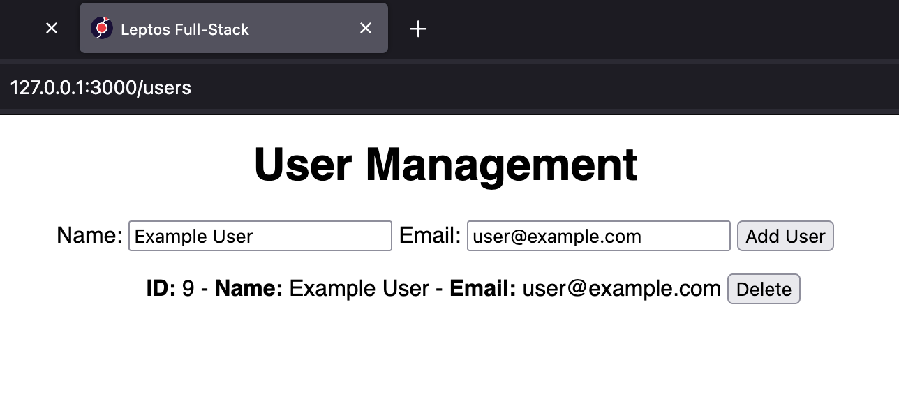

# Leptos Full Stack

Example Rust full-stack built with Leptos, Axum, and SQLx. 🧱

List, add, and delete users from an SQLite database.

<br>



**Download:** https://github.com/hexensemble/leptos-full-stack/releases

Pre-compiled for Linux.

<br>

Set the following environment variables:

```
export LEPTOS_OUTPUT_NAME="leptos-full-stack"
export LEPTOS_SITE_ROOT="site"
export LEPTOS_SITE_PKG_DIR="pkg"
export LEPTOS_SITE_ADDR="127.0.0.1:3000"
export LEPTOS_RELOAD_PORT="3001"
```

Then run the server binary `./leptos-full-stack` and head to 127.0.0.1:3000 in your browser.

<br>

**Features:**

- Full-Stack with Leptos
- Rust from front to back
- Axum REST API integration
- SQLite database
- SQLx for database integration
- CORS configured
- Reactive user interface
- Simple form handling
